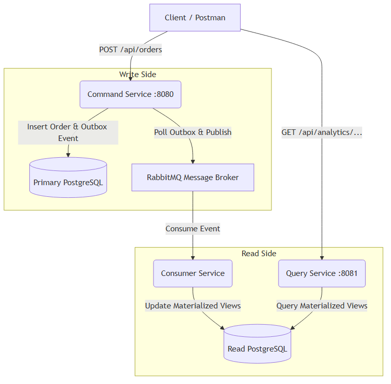

# CQRS and Event-Driven Analytics System

This project is a high-performance e-commerce analytics system built using the Command Query Responsibility Segregation (CQRS) pattern and an Event-Driven Architecture (EDA). It demonstrates how to separate write and read operations, use a message broker for asynchronous communication, and build materialized views for optimized querying.

## Architecture

- **Command Service (Port 8080)**: Handles write operations (`POST /api/products`, `POST /api/orders`). Writes to a primary database and reliably publishes events using the Transactional Outbox pattern.
- **Consumer Service**: Listens for events (`OrderCreated`) from the message broker, processes them idempotently, and updates materialized views.
- **Query Service (Port 8081)**: Provides a read-only API to serve fast analytics data from denormalized materialized views.
- **Message Broker**: RabbitMQ
- **Database**: PostgreSQL (Used for both write schemas and read schemas for simplicity, though they could be split physically).



## Getting Started

### Prerequisites
- Docker and Docker Compose

### Running the Application
1. Clone the repository and navigate to the project root.
2. Copy `.env.example` to `.env` (optional, as defaults are in `docker-compose.yml`).
3. Run the following command:
   ```bash
   docker-compose up --build -d
   ```
4. The system will start:
   - Command Service: `http://localhost:8080`
   - Query Service: `http://localhost:8081`
   - RabbitMQ Management UI: `http://localhost:15672` (guest/guest)
   - PostgreSQL: `localhost:5432`

## API Endpoints

### Command Service (Write Model)
- `POST /api/products`: Create a new product.
- `POST /api/orders`: Create a new order.

### Query Service (Read Model)
- `GET /api/analytics/products/:productId/sales`: Get product sales analytics.
- `GET /api/analytics/categories/:category/revenue`: Get category revenue analytics.
- `GET /api/analytics/customers/:customerId/lifetime-value`: Get customer lifetime value.
- `GET /api/analytics/sync-status`: Check the eventual consistency lag.
